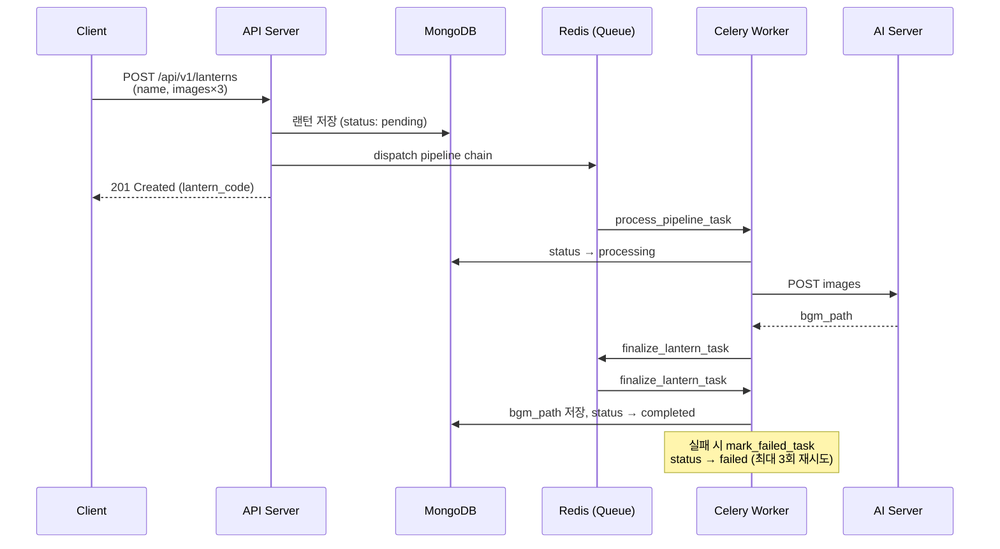
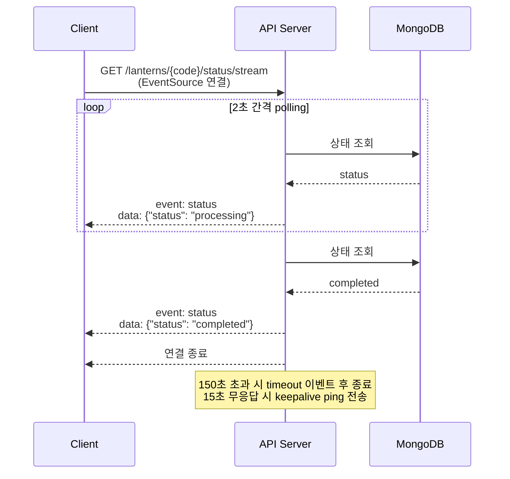

# Lantern API

랜턴 이미지 3장을 업로드하면 AI가 배경음악을 생성해주는 FastAPI 기반 비동기 처리 API

## 주요 기능

- **랜턴 생성**: 이미지 3장 + 이름으로 새 랜턴 등록
- **비동기 AI 처리**: Celery + Redis를 통한 AI 서버 BGM 생성 파이프라인
- **실시간 상태 조회**: SSE(Server-Sent Events)로 처리 상태 스트리밍
- **랜덤 목록 조회**: 내 랜턴을 포함한 20개 랜덤 샘플링

## 기술 스택

| 분류 | 기술 |
|------|------|
| Web Framework | FastAPI |
| Database | MongoDB + Beanie (ODM) |
| Async Queue | Celery + Redis |
| Container | Docker, Docker Compose |
| Runtime | Python 3.12+, uv |

## 빠른 시작

### Docker Compose (권장)

```bash
cp .env.example .env
docker compose up --build
```

API 서버: http://localhost:8000

### 로컬 실행

```bash
# 1. uv 설치 (https://docs.astral.sh/uv/)
# 2. 환경변수 설정
cp .env.example .env

# 3. 개발 서버 실행
uv run fastapi dev app/main.py

# 4. Celery 워커 (별도 터미널)
uv run celery -A app.celery_app.celery_app worker --loglevel=info
```

> 로컬 실행 시 MongoDB와 Redis가 별도로 필요합니다.

## 환경변수

`.env.example`을 복사해 `.env`를 만들고 필요에 따라 수정합니다.

| 변수 | 기본값 | 설명 |
|------|--------|------|
| `MONGODB_URL` | `mongodb://mongo:27017` | MongoDB 연결 URL |
| `DATABASE_NAME` | `agentic_workflow` | 데이터베이스 이름 |
| `CELERY_BROKER_URL` | `redis://localhost:6379/0` | Celery 브로커 |
| `CELERY_RESULT_BACKEND` | `redis://localhost:6379/0` | Celery 결과 저장소 |
| `AI_SERVER_URL` | `http://localhost:8001` | AI 서버 주소 |
| `CORS_ORIGINS` | `["http://localhost:3000"]` | 허용 Origin 목록 |

## API 엔드포인트

| Method | Path | 설명 |
|--------|------|------|
| `POST` | `/api/v1/lanterns` | 랜턴 생성 (이미지 3장 필수) |
| `GET` | `/api/v1/lanterns/{lantern_code}` | 랜턴 상세 조회 |
| `GET` | `/api/v1/lanterns/{lantern_code}/status/stream` | 상태 SSE 스트리밍 |
| `GET` | `/api/v1/lanterns/{lantern_code}/random-list` | 랜덤 목록 조회 (최대 20개) |
| `GET` | `/health` | 헬스 체크 |

자세한 스펙은 서버 실행 후 http://localhost:8000/docs 에서 확인할 수 있습니다.

## 처리 흐름

### 비동기 AI 파이프라인

랜턴 생성 후 Celery가 AI 서버에 이미지를 전달해 BGM을 생성합니다.



### SSE 상태 스트리밍

클라이언트는 `EventSource`로 연결하면 처리 완료까지 상태 이벤트를 실시간으로 받습니다.



## 테스트

```bash
uv run pytest -v
```

테스트 DB는 `mongomock-motor`로 모킹되어 실제 MongoDB 없이 실행됩니다.

## 프로젝트 구조

```
app/
├── routers/      # HTTP 엔드포인트
├── services/     # 비즈니스 로직
├── models/       # MongoDB Document (Beanie)
├── schemas/      # API 입출력 Pydantic 모델
├── tasks/        # Celery 비동기 작업
├── config.py     # 환경변수 설정
├── exceptions.py # 커스텀 예외 (404, 409 등)
└── main.py       # FastAPI 앱 진입점
```
